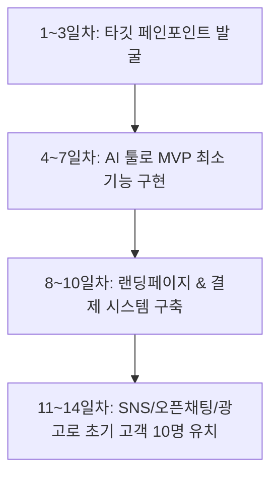

# 🏢 프로젝트 02: AI 1인 기업 급속 창업 & 초스피드 수익 모델 리서치

> **작성일자**: 2026년 8월  
> **기획자**: AI 개발부장 코다리 & AI 1인 기업 대표님  
> **목적**: 자본 0원, AI 기술로 2주 안에 실행해서 빠르게 현금 흐름을 창출하는 린(Lean) 창업 모델

---

## 📌 1. 2026년 AI 1인 기업 창업의 핵심 성공 공식

```
[최소 노동 & 최대 효율 시스템]
고객의 페인 포인트(불편함) 
  ↳ 노코드(n8n/Make) + AI 에이전트로 100% 자동화 
  ↳ MVP 2주 출시 
  ↳ 즉시 수익화 (구독 / 수수료 / 라이선스)
```

- **핵심 법칙**: "기술 개발에 몇 달 쏟지 마라!" → 2주 단위로 최소 기능 제품(MVP)을 내놓고 빠르게 고객 검증.
- **AI 1인 기업가의 해자(Moat)**: 단순 프롬프팅이 아니라 **특화 데이터 + 자동화 워크플로우 결합**.

---

## 🚀 2. 빠르게 땡기는(수익화) TOP 3 추천 비즈니스 모델

### 🔥 [모델 1] B2B 노코드 AI 업무 자동화 구축 대행 (AI Automation Agency - AAA)
- **개요**: AI 도입을 원하지만 방법을 모르는 소상공인, 중소기업, 병원, 학원에 업무 자동화 시스템을 구축해 주는 서비스.
- **주요 서비스 예시**:
  - **고객 문의 자동 응대**: 카카오톡/웹사이트 24시간 AI 상담 에이전트 구축
  - **영업 리드 자동 수집 & 이메일 발송**: n8n + OpenAI API 연동 고객 맞춤 제안서 자동 생성 및 발송
- **수익 구조**:
  - 초기 세팅비: 프로젝트당 **150만원 ~ 300만원**
  - 유지보수 및 서버 관리비: 월 **30만원 ~ 50만원** (구독형)

---

### 🔥 [모델 2] 초선명 타깃 B2B/B2C Micro-SaaS (미니 AI 도구)
- **개요**: 거대한 서비스를 만들지 않고, 특정 직군이 매일 겪는 가려운 곳 딱 1개를 긁어주는 1기능 웹앱 서비스.
- **주요 서비스 아이디어 예시**:
  - **부동산 매물 블로그 글 초스피드 생성기**: 매물 조건만 넣으면 네이버 블로그 최적화 원고 생성
  - **쇼핑몰 상세페이지 카피라이팅 & 이미지 템플릿 생성기**
- **수익 구조**:
  - 월 **9,900원 ~ 29,900원** 정기 구독 (Stripe / 토스페이먼츠 연동)
  - 100명만 모아도 월 100~300만 원 불로소득형 시스템 완성!

---

### 🔥 [모델 3] AI 지식 콘텐츠 & 디지털 자산 자동 판매 (Digital Asset Empire)
- **개요**: 전문 지식이나 가이드를 AI로 전자책, 템플릿, 프롬프트 북으로 제작하여 글로벌/국내 마켓에 자동 판매.
- **주요 제품 예시**:
  - "직장인을 위한 실무 ChatGPT 프롬프트 500선 (노션 템플릿)"
  - "AI로 10분 만에 카드뉴스 만드는 템플릿 패키지"
- **판매 채널**: 크몽, 탈잉, 텀블벅, 굼로드(Gumroad), Etsy
- **수익 구조**: 100% 순이익 마진, 한번 등록해 두면 자는 동안에도 자동 판매!

---

## 📋 3. AI 1인 기업 14일 초스피드 실행 로드맵



1. **[Day 1~3] 문제 정의**: 주변 사람이나 커뮤니티에서 가장 귀찮아하는 일 1개 수집
2. **[Day 4~7] 제품 제작**: Cursor / Claude / Bolt.new / n8n을 이용해 3일 만에 서비스 완성
3. **[Day 8~10] 판매 페이지 오픈**: Framer 또는 Notion + Oopy로 30분 만에 웹사이트 제작 및 결제창 연결
4. **[Day 11~14] 유입 펌핑**: 인스타그램 릴스, 블로그, 오픈채팅방에 서비스 홍보 및 첫 매출 달성!

---
*코다리 개발부장의 한마디: "대표님! 모델 1(AI 자동화 대행)이나 모델 2(미니 SaaS) 중 끌리시는 거 고르시면 저 코다리가 바로 코딩 들어갑니다! 🫡🚀"*
