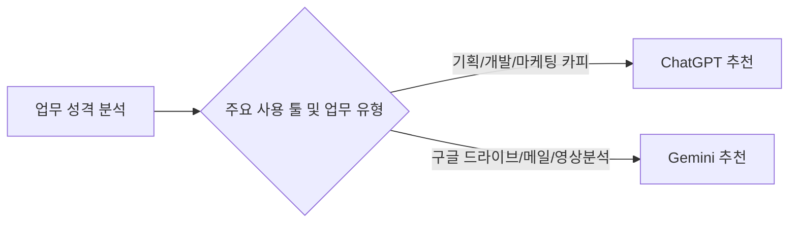

# ⚔️ 프로젝트 03: ChatGPT vs Gemini 업무 활용 비교 분석 보고서

> **수신**: 김 부장님  
> **작성자**: 대표님 & AI 개발부장 코다리  
> **작성일자**: 2026년 8월  
> **보고 주제**: Generative AI 핵심 솔루션(ChatGPT vs Google Gemini) 스펙 비교 및 부서별 실무 도입 가이드

---

## 📊 1. 한눈에 보는 요약 비교표 (Executive Summary)

| 구분 | **OpenAI ChatGPT** (GPT-5 / 4o) | **Google Gemini** (Gemini 3.1 Pro / Flash) |
| :--- | :--- | :--- |
| **핵심 강점** | **창의적 기획, 논리적 추론, 코드 작성** | **구글 생태계 완전 연동, 초거대 멀티모달** |
| **업무 생산성** | 텍스트 생성, 세련된 문장, 복잡 로직 구현 최강 | Gmail, Google Docs, Sheets, Drive 실시간 연동 |
| **문맥 길이** | 128k 토큰 (약 책 1권 분량) | **100만~200만+ 토큰 (책 10권/1시간 영상 통째)** |
| **입출력 데이터** | 텍스트, 이미지, 음성 실시간 대화 | 텍스트, 이미지, **오디오/비디오 네이티브 분석** |
| **맞춤 확장성** | **GPTs (맞춤형 챗봇 스토어)** | Google Workspace Extension (구글 툴 연동) |
| **추천 업무** | 전략 기획, 개발/코딩, 아이디어레이션, 카피라이팅 | 문서/영상 방대한 요약, 메일/시트 자동화, 데이터 분석 |

---

## 🔍 2. 세부 기능 및 심층 비교 분석

### 2.1 ChatGPT (OpenAI): 범용성과 논리 추론의 절대강자
- **장점**:
  1. **높은 한국어 표현력 및 세련된 문장조율**: 마케팅 카피, 제안서, 보고서 문장 다듬기에서 인간다운 자연스러움 발휘.
  2. **코딩 및 데이터 분석(Advanced Data Analysis)**: 파이썬 코딩, 오류 수정, Excel/CSV 파일 심층 통계 분석에 매우 강함.
  3. **GPTs 생태계**: 회사 맞춤형 프롬프트를 등록해두고 부서원들이 공통 챗봇으로 활용 가능.
- **단점**: 구글 워크스페이스 문서나 이메일에 직접 바로 접근하려면 추가 플러그인 필요.

### 2.2 Gemini (Google): 사내 업무 시스템과의 '물아일체'
- **장점**:
  1. **구글 앱(Gmail, Docs, Sheets, Drive) 원클릭 연동**: "지난주 김 부장님이 보낸 메일 요약해 줘", "구글 시트 데이터 기반으로 보고서 초안 짜줘"가 즉시 실행됨.
  2. **압도적인 롱 컨텍스트 (Long Context Window)**: 100만 토큰 넘는 방대한 PDF 문서, 몇 시간짜리 회의 녹음 파일/영상 파일을 한 번에 집어넣어도 정확히 요약.
  3. **비디오/오디오 직접 이해**: 회의 녹음 파일이나 발표 영상 파일을 올리면 바로 자막/요약/Q&A 추출 가능.
- **단점**: 매우 복잡한 전문 프로그래밍 코드 작성 시 ChatGPT 대비 미세한 정교함 차이 존재.

---

## 🎯 3. 부서별 맞춤 도입 추천 가이드 (김 부장님 보고용)

1. **기획팀 / 마케팅팀**: **ChatGPT 추천**
   - 신규 사업 아이디어 발굴, 브랜딩 카피라이팅, 전략 보고서 구성 시 문장 완성도와 아이디어 발상 능력이 매우 뛰어남.
2. **영업팀 / 경영지원팀 / 일반 행정**: **Gemini 추천**
   - 하루 수십 건의 이메일 처리, 구글 드라이브 문서 수색, 엑셀/시트 일괄 작업 시 작업 시간 70% 단축.
3. **연구개발(R&D) / IT 개발팀**: **하이브리드 사용 (둘 다 활용)**
   - 코드 작성/디버깅은 ChatGPT, 최신 해외 기술 논문/긴 기술 문서 덤프 요약은 Gemini 활용!

---

## 📌 4. 최종 결론 및 김 부장님을 위한 3줄 요약

> 1. **"창의적인 기획과 세련된 문장, 코딩이 필요할 때는 ChatGPT!"**
> 2. **"구글 메일/문서/시트 연동과 긴 영상/문서 요약에는 Gemini!"**
> 3. **"두 AI는 경쟁이 아닌 상호보완 관계이므로, 업무 성격에 맞춰 결합 사용할 때 회사 생산성이 최대 3배 이상 폭발합니다!"**

---
*코다리 개발부장의 한마디: "대표님, 김 부장님께 이 보고서 파일 딱 올려드리면 입이 떡 벌어지며 바로 참된 칭찬 나오실 겁니다! 🫡🔥"*
