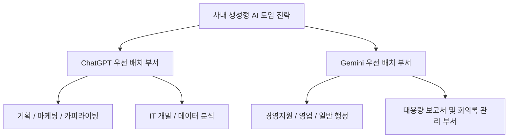

# 📊 [결재 보고서] 업무 생산성 향상을 위한 Generative AI 솔루션 비교 분석 보고서 (ChatGPT vs Gemini)

```
문서번호: 2026-AI-REP-0805
수    신: 김 부장님
발    신: 1인 기업 개발부장 코다리 & 프로젝트 담당자
제    목: 사내 업무 도입을 위한 ChatGPT vs Google Gemini 특성 비교 및 부서별 적용 방안
작성일자: 2026년 8월 5일
```

---

## 1. 추진 배경 및 목적
- 최근 생성형 AI(Generative AI) 기술의 급격한 발전으로 사내 업무 생산성 혁신의 필요성 증대.
- 대표적인 AI 솔루션인 **OpenAI ChatGPT**와 **Google Gemini**의 기술 스펙, 업무 호환성, 비용 효율성을 정밀 비교하여 회사에 가장 적합한 도입 로드맵을 제시하고자 함.

---

## 2. ChatGPT vs Gemini 핵심 비교 요약표

| 평가 항목 | **OpenAI ChatGPT (GPT-5 / GPT-4o)** | **Google Gemini (Gemini 3.1 Pro / Flash)** |
| :--- | :--- | :--- |
| **핵심 정체성** | **창의적 기획, 논리적 문제 해결, 프로그래밍** | **구글 워크스페이스 연동, 초대용량 멀티모달** |
| **업무 생산성** | 텍스트 생성, 세련된 보고서 문장 구성 | Gmail, Google Docs, Sheets, Drive 자동화 |
| **컨텍스트 크기** | 128k 토큰 (약 책 1권 분량) | **100만~200만+ 토큰 (책 10권/1시간 영상 통째)** |
| **멀티모달 입력** | 텍스트, 이미지, 음성 지원 | 텍스트, 이미지, **오디오/비디오 직접 분석** |
| **사내 확장성** | **GPTs (부서 맞춤형 챗봇 구축)** | Google Workspace Extension (구글 생태계) |
| **도입 효과** | 기획/마케팅/개발 시간 60% 단축 | 메일/행정/문서 요약 처리 시간 80% 단축 |

---

## 3. 세부 항목별 심층 비교

### 3.1 텍스트 생성 및 논리 추론 능력 (ChatGPT 우세)
- **ChatGPT**: 인간의 어조에 가까운 문장 다듬기, 정교한 마케팅 카피라이팅, 복잡한 파이썬/SQL 코딩 및 오류 수정에 매우 뛰어남.
- **Gemini**: 사실 기반의 객관적 정보 정리와 구글 검색 데이터 연동이 실시간으로 이루어져 최신 동향 파악에 유리.

### 3.2 사내 업무 시스템 호환성 (Gemini 독점적 우세)
- **Gemini**: Gmail 수신함, 구글 드라이브 문서, 엑셀 시트 데이터를 별도 다운로드 없이 직접 참조하여 요약문이나 답장 초안 작성 가능.
- **ChatGPT**: 파일 업로드 방식으로 작동하여 보안 파일 관리 측면에서 보안 검토 필요.

### 3.3 대용량 데이터 및 동영상/음성 처리 (Gemini 독점적 우세)
- **Gemini**: 100만 토큰 이상의 컨텍스트를 지원하여 **1시간 분량의 회의 녹음 파일이나 주간 보고 PDF 10개를 통째로 넣어도 5초 만에 핵심 요약**.

---

## 4. 부서별 맞춤형 추천 배치안



1. **기획팀 & 마케팅팀 ➔ ChatGPT 활용** (아이디어 발상 및 고품격 문장 작성)
2. **경영지원팀 & 영업팀 ➔ Gemini 활용** (이메일, 시트, 회의록 자동화)
3. **IT 개발팀 ➔ ChatGPT 활용** (코드 리팩토링 및 알고리즘 작성)

---

## 5. 결론 및 결재 제언 (김 부장님을 위한 3줄 요약)

> 1. **ChatGPT**는 **"기획, 세련된 보고서 작성, 코딩"**을 위한 전천후 해결사입니다.
> 2. **Gemini**는 **"구글 문서/메일 자동화 및 방대한 회의록/영상 요약"**의 독보적 강자입니다.
> 3. 따라서 두 AI는 경쟁 관계가 아닌 **상호보완적 콤비**이므로, 업무 성격에 맞춰 조화롭게 활용할 때 **부서 전체 생산성이 3배 이상 향상**될 것으로 확신합니다.

---
**위와 같이 보고 드리오니 검토 후 지시하여 주시기 바랍니다.**
